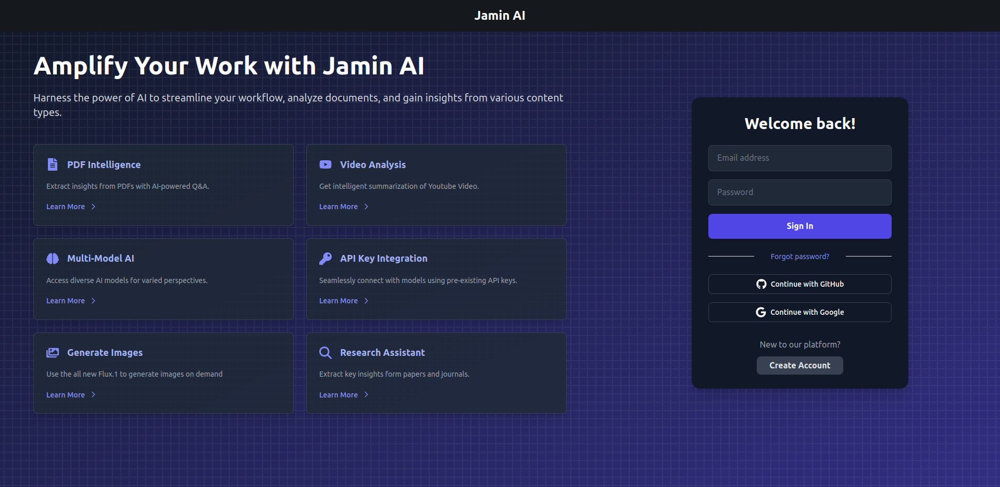

# Jamin AI | Ask Me Anything

Jamin AI is a LLM Aggregator constructed using Node.js and Express for the backend, and React (with Vite) for the frontend. This project integrates multiple Large Language Models (LLMs) to facilitate users in processing and querying their own text files, youtube videos or question answering.

## Features

- Integration with multiple LLMs: OpenAI, Cohere and Anthropic AI models.
- PDF Intelligence: Extract insights from PDFs with AI-powered Q&A.
- Video Analysis: Get intelligent summarization of Youtube Video.
- Research Assistant: Extract key insights form papers and journals.
- Generate Images: Use the all new Flux.1 to generate images on demand.
- API Key Integration: Seamlessly connect with models using pre-existing API keys.

## Tech Stack

### [Frontend](/frontend/README.md)

- React
- Vite
- Tailwind
- Daisy UI
- Framer Motion
- Tanstack react-query
- React-Router

### [Backend](/backend/README.md)

- Node JS
- Express
- Passport
- Typescript
- Langchain
<!-- 
### DB Schema

 -->
